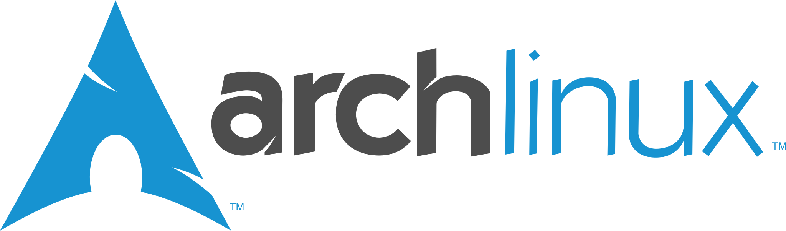

### Hi there, I am Gianluca Fiore (aka Donearm, aka The Fountain Pen Creator and more)

Lots of names for a single person! I have been self-teaching myself programming and system administration for about 20 years, with no end of the learning in sight.

I am a **Python/Go** programmer, **Linux** administrator and FOSS enthusiast, **DevOps** Engineer and, nowadays, **Technical/Content Writer**. I am an enthusiast about learning new concepts, documenting them, and raising awareness on the issues our world faces. Creating useful documentation and making it simpler to understand hard concepts is a **pleasure** for me, before being my job.

----

### Toolbox and Technologies

----

### Where you can reach me

* [Technical/Content Writer site](https://www.fountainpencreator.com)
* [My personal site](https://www.gianlucafiore.it)
* [Linkedin](https://www.linkedin.com/in/gianluca-fiore-a70913b6)
* [Instagram](https://www.instagram.com/gianlucadfiore)
* [Email](mailto:gianlucafiore@fountainpencreator.com)

----

### Latest blog posts

_Travel/Food related articles_
<!-- FPC:START -->
- [How to Describe Coffee](https://www.fountainpencreator.com/post/how_to_describe_coffee/)
- [What&#39;s SEO for? What&#39;s in it for me?](https://www.fountainpencreator.com/post/what_s_seo_for_what_s_in_it_for_me/)
- [Nespresso vs Espresso. How do they compare?](https://www.fountainpencreator.com/project/nespresso_vs_espresso_how_do_they_compare/)
- [Why I became a food writer](https://www.fountainpencreator.com/post/why_i_became_a_food_writer/)
- [Where I will travel in 2021 once the restrictions are dropped](https://www.fountainpencreator.com/project/where_i_will_travel_in_2021_once_the_restrictions_are_dropped/)
<!-- FPC:END -->

_Technical/personal articles_
<!-- GF:START -->
- [Pulse 15 update after one year](https://www.gianlucafiore.it/blog/pulse-15-update-after-one-year/)
- [Pulse 15 Review](https://www.gianlucafiore.it/blog/pulse-15-review/)
- [Fountain Pen Creator](https://www.gianlucafiore.it/blog/fountain-pen-creator/)
- [Cv](https://www.gianlucafiore.it/cv/)
- [My Story](https://www.gianlucafiore.it/my-story/)
<!-- GF:END -->

----

### What I do in my spare time

Usually you can find me with my nose in a book (or, more recently, in my e-book reader). I read whenever possible, with a strong passion being fantasy literature (how original for a programmer eh?), history, philosophy, mythology, languages and the classics (from Gilgamesh to Dostoevsky). The general plan being reading at least 1000 books before I die (keeping track on [Goodreads](https://www.goodreads.com/review/list/25653929-gianluca-fiore?ref=nav_mybooks)).

Outside of reading, I write for myself (travelling and coffee being two big passions), I watch lots of football, occasionally movies, and update [my knowledge wiki](https://www.gianlucafiore.it/Personal-Wiki/).

If you like what I do, you can support me with a [donation](https://ko-fi.com/W7W7KA0Z).

<!--
**Donearm/Donearm** is a ✨ _special_ ✨ repository because its `README.md` (this file) appears on your GitHub profile.

Here are some ideas to get you started:

- 🔭 I’m currently working on ...
- 🌱 I’m currently learning ...
- 👯 I’m looking to collaborate on ...
- 🤔 I’m looking for help with ...
- 💬 Ask me about ...
- 📫 How to reach me: ...
- 😄 Pronouns: ...
- ⚡ Fun fact: ...
-->
